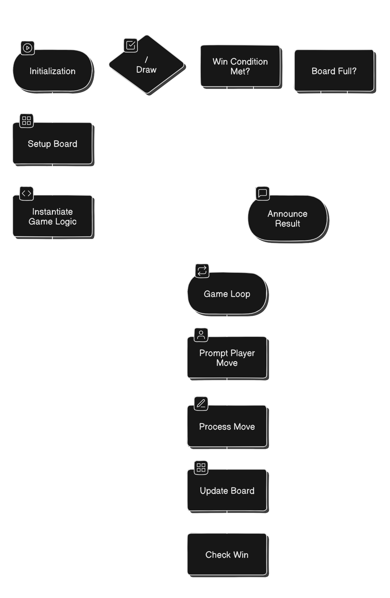

# Tic-Tac-Toe Game

This is a simple Tic-Tac-Toe game implemented in Java. The game allows two players to take turns making moves on a 3x3 grid. The game ensures there is no draw by implementing a rule where the first X or O will be removed if no one wins in three moves.

## Features

- Two-player gameplay
- Move validation
- Win detection
- No-draw rule: First X or O is removed if no one wins in three moves

## Getting Started

### Prerequisites

- Java Development Kit (JDK) installed
- An IDE such as IntelliJ IDEA, Eclipse, or NetBeans
- Maven for dependency management (optional)

### Installing

1. **Clone the repository:**
   ```bash
   git clone https://github.com/abhijeetkakade1234/tic-tac-toe.git
   cd tic-tac-toe
2. **Open the project in your preferred IDE:**
  - Import the project as a Maven project if you are using Maven.
  - Alternatively, set up the project manually if you are not using Maven.

### Game Instruction
1. **Starting the Game:**
  - The game will prompt Player X to make the first move by entering a row and column.
    
2. **Making a Move:**
  - Enter the row and column numbers to place your mark (X or O) on the board.
  - The board will be displayed after each move.
3. **Winning the Game:**
  - The game will check for a win after each move and announce the winner if a win condition is met.
  -  If no player wins after three moves, the first X or O will be removed from the board to ensure there is no draw.
4. **Switching Players:**
  - The game will automatically switch players after each valid move.

## Classes and Methods
### Main Class
 - Purpose: Manages the overall flow of the game.
 - Key Methods:
     - main(String[] args): Initializes the game, handles player inputs, and manages the game loop.
  
### Board Class
  - Purpose: Manages the game board and its state.
  - Key Methods:
    - initialize(): Sets up the board.
    - printBoard(): Prints the current state of the board.
    - placeMove(int row, int col, char player): Places a move on the board.
    - removeMove(int row, int col): Removes a move from the board.
    - isValidMove(int row, int col): Checks if a move is valid.
   
### TicTacToe Class
  - Purpose: Manages the game logic.
  - Key Methods:
    - getCurrentPlayer(): Returns the current player.
    - makeMove(int row, int col): Handles game logic for making a move.
    - checkWin(): Checks if the current player has won.
    - resetGame(): Resets the game state.
    - switchPlayer(): Switches to the next player.
    - isGameOver(): Determines if the game is over.

## Steps to Run the Code
  1. Compile all the .java files:
    ``` bash
    javac Move.java Board.java TicTacToe.java Main.java
    ```
  2. Run the Main class:
    ``` bash
    java Main
    ```

## Demo Play

  ``` bash
Player X Move
 | | 
-----
 | | 
-----
 | | 
Enter row (0, 1, or 2):
0
Enter column (0, 1, or 2):
0
O turn
X| | 
-----
 | | 
-----
 | | 
Enter row (0, 1, or 2):
1
Enter column (0, 1, or 2):
1
X turn
X| | 
-----
 |O| 
-----
 | | 
Enter row (0, 1, or 2):
0
Enter column (0, 1, or 2):
1
O turn
X|X| 
-----
 |O| 
-----
 | | 
Enter row (0, 1, or 2):
1
Enter column (0, 1, or 2):
0
X turn
X|X|
-----
O|O|
-----
 | |
Enter row (0, 1, or 2):
0
Enter column (0, 1, or 2):
2
X|X|X
-----
O|O|
-----
 | |
X WON
DO YOU WANT TO PLAY NEXT ROUND
Press 0 to restart OR any number to QUIT
```


This `README.md` file provides a concise guide to your Tic-Tac-Toe project's backend logic, including installation instructions, game instructions, class and method descriptions, and contribution guidelines.

## License

This project is licensed under the MIT License - see the [LICENSE](LICENSE) file for details.

## Contact

For support or inquiries, please email us at abhijeetskakade04@gmail.com.
<br>

